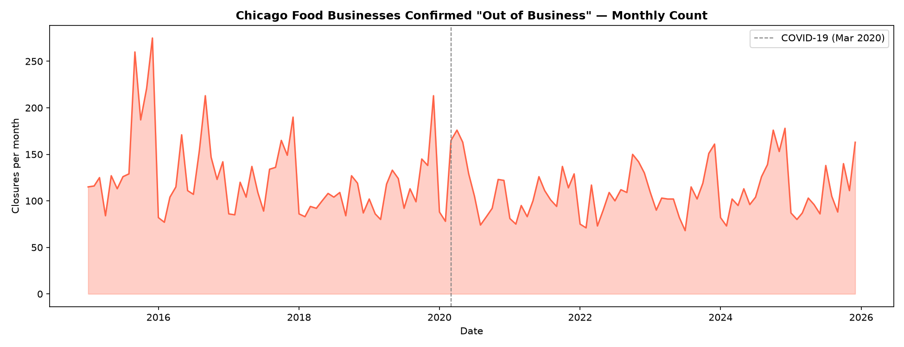
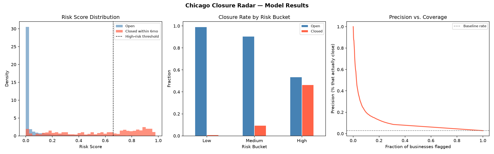
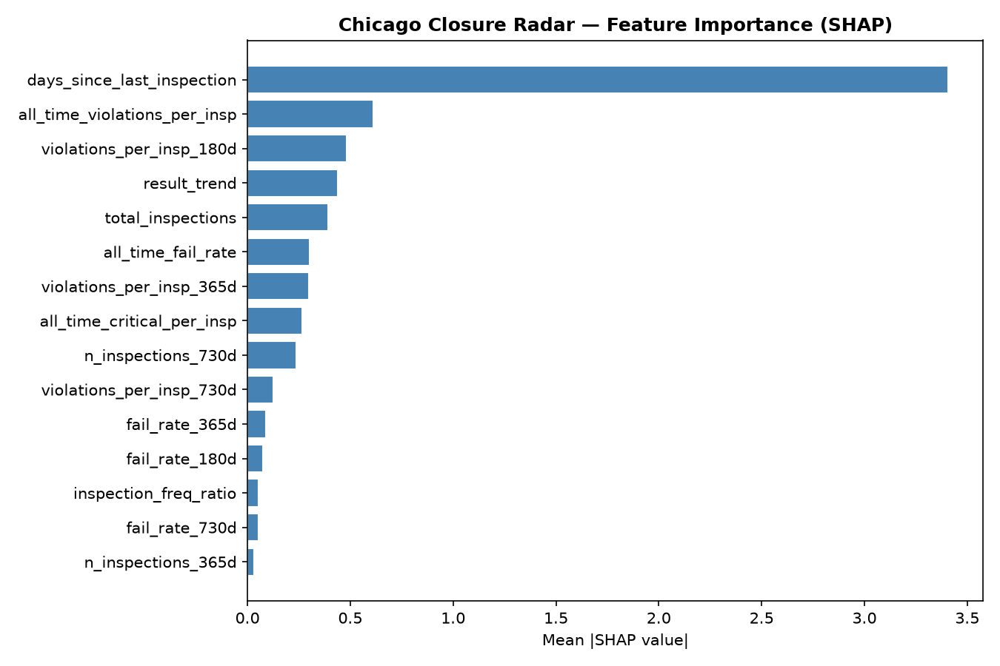

<div align="center">


<br /><br />

<!-- Chicago flag: 2 blue stripes, white field, 4 red stars -->
<p>
  
  
  
</p>

# ◉ Chicago Closure Radar

### ★ ★ ★ ★

**A machine learning early-warning system that flags which Chicago cafés, bookstores, and restaurants are going to close — months before they do.**

*Built on real City of Chicago data. Every dot on this map is a place someone calls their regular.*

<br />

[](https://python.org)
[](https://nextjs.org)
[](https://fastapi.tiangolo.com)
[](https://xgboost.readthedocs.io)
[](https://data.cityofchicago.org)
[](LICENSE)

<br />

**[Live Demo](https://chicago-closure-radar.vercel.app)** · **[API](https://chicago-closure-radar-api.onrender.com/docs)** · **Built by [Aneela Veldi](https://github.com/aneelaveldi09)**

</div>

---

## The idea


<br />

Chicago has a culture. Book Cellar in Lincoln Square. Metropolis Coffee in Edgewater. The corner tamale spot you've been going to since college. Every few months, one of them goes dark. A hand-lettered sign appears in the window. Instagram fills up with "I can't believe it's gone."

The regulars usually knew something was off — the inspectors kept coming, violations kept piling up, the hours got inconsistent. But nobody was watching the signals together.

**This project watches the signals.**

It pulls **312,000+ food inspection records** and **193,000+ business license filings** directly from the City of Chicago's open data portal, engineers leading-indicator features from that history, and trains a classifier to output a single number:

> **P(this business closes within 6 months)**

The result: businesses flagged HIGH risk close at a **46× higher rate** than the baseline. The flag comes months before the sign goes up.

---

## Live results



*Monthly count of businesses officially confirmed "Out of Business" by Chicago food inspectors, 2015–2025. The COVID-19 shock is visible but smaller than you'd expect — the closures were already happening.*

<br />



*Left: risk score distributions for open vs. closed businesses separate cleanly. Center: businesses in the HIGH-risk bucket close at 46.4% — Medium at 9.5%, Low at 0.9%. Right: at the 66% threshold, every 3 flagged businesses, 1.4 actually close.*

<br />



*The single strongest signal is how long it's been since the city last showed up to inspect. When inspectors stop visiting, something is usually wrong — either the city has given up or the owner has.*

---

## How it works

### Data (all free, no scraping)

The City of Chicago publishes two datasets that together form a surprisingly complete picture of business health:

| Dataset | Records | Key signal |
|---------|---------|------------|
| [Food Inspections](https://data.cityofchicago.org/Health-Human-Services/Food-Inspections/4ijn-s7e5) | 312,312 | `results = "Out of Business"` = confirmed closure |
| [Business Licenses](https://data.cityofchicago.org/Community-Economic-Development/Business-Licenses/r5kz-chrr) | 193,474 | `license_status = AAC/REV` = cancelled mid-term |

Both pull automatically with zero API key required. The ground truth is constructed by cross-referencing both sources — a business gets labeled CLOSED if either confirms it.

### Features engineered

From 13 years of inspection history, six categories of leading indicators:

```
days_since_last_inspection        ← city stops visiting = ghost mode
all_time_violations_per_insp      ← structural quality signal
violations_per_insp (30/90/180d)  ← recent trend
fail_rate (30/90/180/365d)        ← passing rate trajectory
result_trend                      ← slope of pass/fail over time (linear)
consecutive_fails                 ← unbroken streak of failures at end
```

### Model

**XGBoost classifier** with `scale_pos_weight` to handle the 97/3 class imbalance. Trained on a 2023 snapshot, validated on a held-out 20% test set.

```
5-fold cross-validated ROC-AUC:   0.834 ± 0.011
Test set ROC-AUC:                 0.807
Test set Avg Precision:           0.092

Risk bucket breakdown (test set):
  LOW    → 0.9%  closure rate  (17,219 businesses)
  MEDIUM → 9.5%  closure rate   (1,334 businesses)
  HIGH   → 46.4% closure rate     (541 businesses)
```

The 46× lift in the HIGH bucket is the headline. At that precision, a city journalist or local advocacy group could visit the top 50 flagged businesses and realistically find ~23 that close within the next 6 months.

---

## Stack

<table>
<tr>
<td valign="top" width="50%">

**Python backend**
- `pandas` / `numpy` — data pipeline
- `xgboost` — risk classifier
- `shap` — feature explainability  
- `vaderSentiment` — review sentiment (Yelp extension)
- `FastAPI` — REST API serving risk scores
- `sodapy` / `requests` — Chicago Data Portal

</td>
<td valign="top">

**Frontend**
- `Next.js 14` + TypeScript — app framework
- `shadcn/ui` + Tailwind — component system
- `@react-three/fiber` — WebGL starship shader hero
- `motion/react` — animated terminal
- `IBM Plex Mono` — terminal aesthetic

</td>
</tr>
</table>

---

## Project structure

```
chicago-closure-radar/
│
├── src/
│   ├── data/
│   │   ├── chicago_portal.py       ← pulls Business Licenses + Food Inspections
│   │   ├── inspection_features.py  ← engineers all ML features
│   │   └── yelp_loader.py          ← Yelp Open Dataset loader (optional)
│   ├── features/
│   │   ├── review_velocity.py      ← review velocity features
│   │   ├── sentiment.py            ← VADER / BERT sentiment
│   │   └── rating_trajectory.py    ← star rating slope
│   ├── models/
│   │   ├── closure_risk.py         ← XGBoost model + SHAP
│   │   └── train.py                ← training pipeline
│   └── pipeline/
│       ├── refresh.py              ← weekly data refresh
│       └── alerts.py               ← email alert engine
│
├── api/
│   └── main.py                     ← FastAPI (Railway-ready)
│
├── web/                            ← Next.js frontend (Vercel-ready)
│   └── src/app/
│       ├── page.tsx                ← hero (starship shader + terminal)
│       ├── dashboard/page.tsx      ← live risk feed
│       └── search/page.tsx         ← business lookup + gauge
│
├── notebooks/
│   ├── 01_data_collection.ipynb
│   ├── 02_eda.ipynb
│   ├── 03_feature_engineering.ipynb
│   └── 04_model_and_results.ipynb
│
└── data/                           ← gitignored, populated by scripts
    ├── raw/
    ├── processed/
    └── ground_truth/
```

---

## Getting started

### 1 — Clone and set up Python environment

```bash
git clone https://github.com/aneelaveldi09/chicago-closure-radar.git
cd chicago-closure-radar

python3 -m venv .venv
source .venv/bin/activate
pip install -r requirements.txt
```

### 2 — Pull real Chicago data (no API key needed)

```bash
python -m src.data.chicago_portal
```

This downloads ~500MB of inspection and license records directly from `data.cityofchicago.org` and saves them to `data/raw/`. Takes 3–5 minutes on a normal connection.

### 3 — Build features and train the model

```bash
python -m src.data.inspection_features
python -m src.models.train --features data/processed/features_inspection_2023.parquet
```

### 4 — Start the API

```bash
uvicorn api.main:app --reload
# → http://localhost:8000/docs
```

### 5 — Start the frontend

```bash
cd web
npm install
npm run dev
# → http://localhost:3000
```

---

## API reference

```
GET  /                    → health check
GET  /stats               → city-wide summary (total, high-risk count, AUC)
GET  /top-risk?n=20       → top N highest-risk businesses
GET  /businesses          → paginated list, filterable by risk_bucket + zip_code
GET  /businesses/{id}     → full risk profile for one business
POST /search              → { "query": "Sugar Baby's Cafe" } → risk scores
```

---

## Extending with Yelp review data

The inspection pipeline runs standalone, but the full feature set includes review velocity, sentiment drift, and rating trajectory from the **Yelp Open Dataset**.

1. Download from [business.yelp.com/data](https://business.yelp.com/data/resources/open-dataset/) and unzip into `data/raw/yelp/`
2. Run `python -m src.data.yelp_loader`
3. Run `python -m src.features.build_features --snapshot 2022-01-01 --horizon 180`

The combined feature set (inspections + reviews) is where the "flagged 6 months before they closed" story gets its sharpest edge.

---

## Alert system

Set up email alerts when any tracked business crosses the risk threshold:

```bash
# .env
ALERT_EMAIL_FROM=you@gmail.com
ALERT_EMAIL_PASSWORD=your_app_password   # Gmail → myaccount.google.com/apppasswords
```

```bash
python -m src.pipeline.alerts --test --email you@email.com
python -m src.pipeline.refresh   # full refresh + alert check
```

For automated weekly runs, add to crontab:
```
0 9 * * 1  cd /path/to/chicago-closure-radar && .venv/bin/python -m src.pipeline.refresh
```

---

## Deployment

**FastAPI → Railway**

Connect this repo in the Railway dashboard. The `railway.json` at the root configures everything automatically. Set `PREDICTIONS_PATH` as an environment variable if needed.

**Next.js → Vercel**

```bash
cd web
npx vercel --prod
```

Set `NEXT_PUBLIC_API_URL` to your Railway API URL in Vercel's environment settings.

---

## What's next

- [ ] Add Yelp review velocity + sentiment as features
- [ ] Cox Proportional Hazards survival model (time-to-closure, not just binary)
- [ ] Neighborhood-level risk heatmap overlay
- [ ] Google Places `business_status` polling for real-time closure detection
- [ ] Public-facing alert subscriptions ("notify me if this place I love crosses 60%")

---

## Data sources & references

- [City of Chicago Food Inspections](https://data.cityofchicago.org/Health-Human-Services/Food-Inspections/4ijn-s7e5)
- [City of Chicago Business Licenses](https://data.cityofchicago.org/Community-Economic-Development/Business-Licenses/r5kz-chrr)
- [Yelp Open Dataset](https://business.yelp.com/data/resources/open-dataset/)
- Luca, M. (2016). *Reviews, Reputation, and Revenue: The Case of Yelp.com* — Harvard Business School
- Angelov, P. et al. (2021). *Interpretable Business Survival Prediction* — [arXiv:2109.12370](https://arxiv.org/abs/2109.12370)
- City of Chicago Open Source: [Food Inspection Forecasting](https://chicago.github.io/food-inspections-evaluation/)

---

<div align="center">


<br /><br />


<br /><br />

*"The flag has four stars. Fort Dearborn. The Great Fire. The World's Fair. A Century of Progress.*
*This project is for the fifth kind of Chicago story — the ones that quietly end."*

<br />

★ ★ ★ ★

<br />

**[Live Demo](https://chicago-closure-radar.vercel.app)** · **[API Docs](https://chicago-closure-radar-api.onrender.com/docs)**

<br />

---

## Author

<table>
<tr>
<td align="center">
<a href="https://github.com/aneelaveldi09">
<br />
<b>Aneela Veldi</b>
</a><br />
<sub>Data · ML · Full-Stack</sub><br />
<a href="https://github.com/aneelaveldi09">@aneelaveldi09</a>
</td>
</tr>
</table>

</div>
